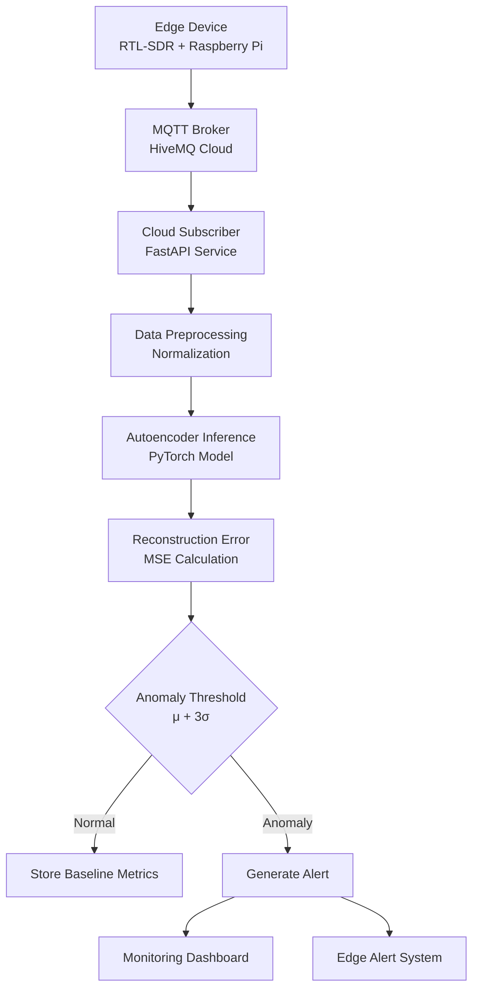
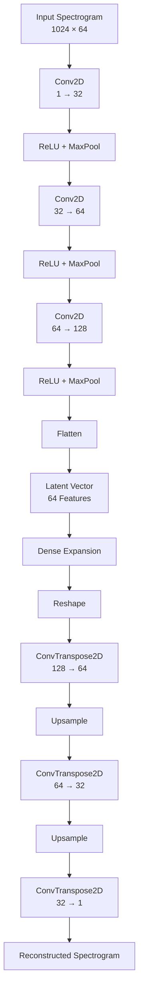

# ML Layer and Cloud Inference Architecture
### RF Spectrum Anomaly Hunter

Author: Basudev Haldar  
Issue Reference: #6

---

## 1. Research Objective

This document describes the design of the Machine Learning layer responsible for detecting anomalous radio-frequency transmissions in the RF Spectrum Anomaly Hunter system.

The system monitors the 433 MHz ISM band and detects unauthorized transmitters using an unsupervised deep learning model. Instead of relying on labeled attack datasets, the system learns the baseline behavior of legitimate RF signals and flags deviations using reconstruction error.

The core of the ML system is a Convolutional Autoencoder (CAE) designed to model normal RF spectrogram patterns.

Primary responsibilities of the ML layer:

• Learn the baseline spectral structure of authorized devices  
• Reconstruct RF spectrograms during inference  
• Detect anomalies using reconstruction error  

---

## 2. RF Signal Representation

Raw RF signals captured using the RTL-SDR are converted into spectrograms before being processed by the neural network.

Spectrogram configuration:

Frequency bins: 1024  
Time windows: 64  
Channels: 1 (grayscale)

Spectrograms transform RF signals into a time–frequency representation, allowing the problem to be treated similarly to an image-processing task.

---

## 3. Post-MQTT ML Data Flow

After edge processing, spectrogram data is transmitted through MQTT to the cloud inference layer.

---

# AUTOENCODER MODEL

## 4. Why Autoencoders for RF Anomaly Detection

Traditional RF intrusion detection methods rely on supervised classification models that require labeled attack datasets. However, collecting labeled RF attack signals is extremely difficult in real environments.

Autoencoders solve this problem by learning only the distribution of normal RF signals.

Training process:

Normal RF signals → Autoencoder learns spectral structure.

Inference process:

Unknown signals → Reconstruction error increases.

This enables detection of:

• rogue transmitters  
• cloned devices  
• unexpected modulation patterns  
• unknown RF activity  

without requiring attack labels.

---

## 5. Convolutional Autoencoder Architecture

The anomaly detection model is implemented as a Convolutional Autoencoder (CAE).

Structure:

Encoder → Latent Representation → Decoder

Input: Spectrogram (1024 × 64)  
Output: Reconstructed spectrogram

---

## 6. Encoder Network

The encoder extracts hierarchical spectral features from the RF spectrogram.

Each convolutional layer captures increasingly complex RF characteristics:

Low-level layers detect basic spectral energy patterns.

Mid-level layers identify signal bandwidth and modulation characteristics.

High-level layers capture device-specific RF fingerprints.

Pooling operations reduce spatial resolution while preserving meaningful spectral features.

---

## 7. Latent RF Fingerprint Representation

The encoder compresses the spectrogram into a 64-dimensional latent vector.

Original spectrogram size:

1024 × 64 = 65,536 values

Latent representation:

64 values

Compression ratio ≈ 1000×.

The latent vector captures key RF characteristics including:

• carrier frequency offset  
• signal bandwidth  
• modulation structure  
• energy distribution  
• device-specific artifacts  

This latent representation effectively acts as an RF fingerprint.

---

## 8. Decoder Network

The decoder reconstructs the original spectrogram from the latent representation.

The reconstruction process uses transposed convolution layers to progressively restore spatial resolution.

If the signal belongs to the learned distribution of normal RF activity, reconstruction error remains low.

When an unknown or anomalous signal appears, the decoder cannot reproduce its spectral structure accurately, resulting in higher reconstruction error.

---

## 9. Training Objective

The autoencoder is trained to minimize the difference between the input spectrogram and the reconstructed spectrogram.

Loss function:

Mean Squared Error (MSE)

Mathematical formulation:

Let X represent the input spectrogram.

Let X̂ represent the reconstructed spectrogram.

MSE(X, X̂) = (1/N) Σ (Xi − X̂i)²

The training objective is to minimize this reconstruction loss across normal RF signals.

---

## 10. Reconstruction Error Behaviour

Normal RF signals:

Low reconstruction error  
Accurate spectrogram reconstruction  

Anomalous RF signals:

High reconstruction error  
Distorted reconstruction  

This difference allows anomaly detection without explicit classification.

---

## 11. Threshold-Based Detection

An anomaly threshold is determined using training reconstruction error statistics.

Let:

μ = mean reconstruction error  
σ = standard deviation

Threshold:

μ + 3σ

Decision rule:

If reconstruction_error > threshold → anomaly detected.

---

## 12. Explainability Layer (Grad-CAM)

Deep learning models often behave as black boxes. To provide interpretability, Grad-CAM is used to generate heatmaps showing which regions of the spectrogram influenced the anomaly detection decision.

Grad-CAM highlights:

• suspicious frequency bands  
• interference bursts  
• unexpected spectral patterns  

This enables human analysts to understand why a signal was flagged as anomalous.

---

## 13. Model Complexity

| Component | Approximate Parameters |
|----------|------------------------|
| Encoder Layers | ~120K |
| Latent Dense Layer | ~64K |
| Decoder Layers | ~120K |
| Total Model Size | ~300K parameters |

The relatively small model size allows efficient inference in cloud environments.

---

## 14. Key Advantages of Autoencoders

• No requirement for labeled attack datasets  
• Ability to detect previously unseen RF signals  
• Compact latent representation of RF fingerprints  
• Effective anomaly detection through reconstruction error  
• Compatible with spectrogram-based RF analysis  

---

## 15. Limitations

Model performance depends on diversity of baseline training data.

Highly dynamic RF environments may require adaptive thresholds.

The current implementation focuses only on the 433 MHz band.

---

## 16. Future Work

Potential improvements include:

Multi-band RF anomaly detection  
Online learning for adaptive environments  
Edge inference optimization  
Federated RF anomaly detection across multiple sensors  

---

## 17. References

O'Shea, T., & Hoydis, J. — Deep Learning for the Physical Layer

Jian, X. et al. — Deep Learning for RF Fingerprinting

Selvaraju, R. et al. — Grad-CAM: Visual Explanations from Deep Networks
