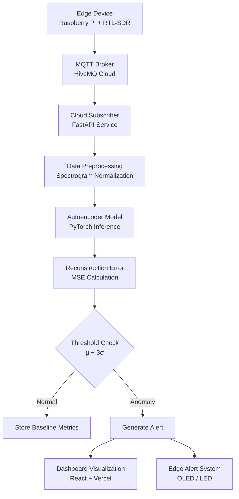

\# ML Layer and Cloud Inference Architecture

\## Research Objective

The objective of this document is to define and explain the design of the Machine Learning (ML) layer and the cloud inference pipeline used in the RF Spectrum Anomaly Hunter system. The system focuses on detecting anomalous radio frequency transmissions within the 433 MHz ISM band using an unsupervised deep learning approach.

Traditional RF intrusion detection techniques depend heavily on labeled datasets that include known attacks. However, collecting labeled RF attack data is extremely difficult in real-world environments. To address this limitation, the proposed system uses a Convolutional Autoencoder trained only on normal RF activity. The model learns the baseline behavior of authorized devices and identifies deviations by measuring reconstruction error.

The ML layer therefore performs three main functions:

\- Learn the normal RF spectrum patterns of authorized IoT devices

\- Reconstruct incoming spectrogram data using the trained model

\- Detect anomalies by comparing reconstruction error against a statistical threshold

\## Post-MQTT System Architecture

Once RF data is captured and processed on the edge device, the resulting spectrogram features are transmitted to the cloud using MQTT. The ML inference pipeline operates after the MQTT broker stage.

System architecture after MQTT transmission:

Edge Device (Raspberry Pi + RTL-SDR)

↓

MQTT Broker (HiveMQ Cloud)

↓

Cloud Subscriber Service (FastAPI)

↓

Data Preprocessing Layer

↓

Autoencoder Model Inference

↓

Reconstruction Error Calculation

↓

Anomaly Detection Module

↓

Alert Generation and Dashboard Update

The cloud inference service is responsible for receiving incoming RF features, running the ML model, and generating alerts when abnormal transmissions are detected.

\## Data Flow Pipeline

The ML data flow pipeline operates in the following sequence:

1\. The edge device generates a spectrogram from captured RF signals.

2\. Spectrogram features are transmitted to the cloud via MQTT.

3\. The cloud service subscribes to the MQTT topic and receives incoming data.

4\. The received message is decoded and normalized.

5\. The spectrogram tensor is passed to the Autoencoder model.

6\. The model reconstructs the spectrogram.

7\. Reconstruction error is computed between input and output.

8\. The error value is compared against an anomaly threshold.

9\. If the threshold is exceeded, the transmission is flagged as anomalous and an alert is generated.

\## RF Spectrogram Representation

RF signals captured from the RTL-SDR are converted into spectrogram images before being processed by the ML model.

Input representation:

Spectrogram resolution: 1024 frequency bins by 64 time windows

Channels: 1 (grayscale)

Spectrograms transform RF signals into a time-frequency representation that can be processed effectively using convolutional neural networks.

\## Autoencoder Model Architecture

The anomaly detection model is implemented as a Convolutional Autoencoder. Autoencoders are neural networks designed to learn a compressed representation of input data and reconstruct the original input from that representation.

Architecture overview:

Encoder → Latent Space → Decoder

Input:

Spectrogram image with dimensions 1024 by 64

Output:

Reconstructed spectrogram and reconstruction error score

\## Encoder Design

The encoder extracts hierarchical features from the spectrogram using convolutional layers and progressively compresses the data into a latent representation.

Layer structure:

Conv2D layer (1 input channel to 32 feature maps)

Kernel size: 3 by 3

Activation: ReLU

Max pooling: 2 by 2

Conv2D layer (32 to 64 feature maps)

Kernel size: 3 by 3

Activation: ReLU

Max pooling: 2 by 2

Conv2D layer (64 to 128 feature maps)

Kernel size: 3 by 3

Activation: ReLU

Max pooling: 2 by 2

Flatten layer

Dense layer producing a 64-dimensional latent vector

\## Latent Space Representation

The latent space contains a compressed representation of the RF spectrogram. This representation captures the most important spectral features of the signal.

Compression characteristics:

Original spectrogram size:

1024 × 64 = 65,536 values

Latent vector size:

64 values

This compression forces the model to retain only the most meaningful RF characteristics, effectively producing a compact RF fingerprint.

\## Decoder Design

The decoder reconstructs the original spectrogram from the latent representation.

Architecture:

Dense layer expanding latent vector to 128 × 128 × 8

Reshape layer

ConvTranspose2D layer (128 to 64 channels)

Activation: ReLU

Upsampling

ConvTranspose2D layer (64 to 32 channels)

Activation: ReLU

Upsampling

ConvTranspose2D layer (32 to 1 channel)

Activation: Sigmoid

Upsampling

Output:

Reconstructed spectrogram with dimensions 1024 by 64

\## Training Methodology

The model is trained exclusively using spectrograms generated from authorized devices. Because the training dataset contains only normal RF activity, the model learns to accurately reconstruct legitimate signals while failing to reconstruct unfamiliar patterns.

Training dataset size:

10,000 spectrogram samples

Training environment:

Google Colab with NVIDIA Tesla T4 GPU

Framework:

PyTorch

Training parameters:

Epochs: 50

Batch size: 32

Optimizer: Adam

Learning rate: 0.001

\## Reconstruction Error Based Anomaly Detection

After training, the model is deployed in inference mode. Incoming spectrograms are passed through the autoencoder and reconstructed.

The anomaly score is defined as the Mean Squared Error between the input spectrogram and the reconstructed spectrogram.

Normal signals produce low reconstruction error because the model has learned their structure. Unknown or abnormal signals produce higher reconstruction error.

\## Threshold Determination

An anomaly threshold is calculated using statistical properties of the reconstruction error observed during training.

Let μ represent the mean reconstruction error and σ represent the standard deviation.

Threshold = μ + 3σ

If the reconstruction error of an incoming spectrogram exceeds this threshold, the signal is classified as anomalous.

\## Cloud Inference Pipeline

The cloud inference system is implemented as a FastAPI service responsible for running the trained ML model.

Main responsibilities of the cloud inference service include:

\- Subscribing to MQTT topics

\- Receiving RF spectrogram data

\- Running autoencoder inference

\- Calculating anomaly scores

\- Storing anomaly events

\- Sending alerts to the monitoring dashboard

Target inference latency for the system is less than 150 milliseconds.

\## Explainability Layer

To improve interpretability, Grad-CAM is applied to visualize which regions of the spectrogram contributed most strongly to the anomaly detection decision.

Grad-CAM produces heatmaps highlighting:

\- Suspicious frequency bands

\- Temporal bursts of interference

\- Unusual transmission patterns

These visualizations help analysts understand why the system flagged a particular RF signal as anomalous.

\## Key Insights

Unsupervised learning eliminates the need for labeled attack data, making the system adaptable to new environments. Spectrogram-based representations allow RF signals to be analyzed using well-established computer vision techniques. Reconstruction error provides a simple yet effective metric for anomaly detection in RF data. The hybrid edge-cloud architecture reduces bandwidth consumption while maintaining high detection accuracy.

\## Implementation Recommendations

Future improvements to the system may include model quantization to accelerate inference performance, adaptive thresholding to account for dynamic RF environments, temporal anomaly correlation across multiple spectrogram frames, and persistent storage of anomaly events for long-term RF security analysis.

\## References

O'Shea, T., and Hoydis, J. Deep Learning for the Physical Layer

Jian, X., et al. Deep Learning for RF Fingerprinting

Selvaraju, R., et al. Grad-CAM: Visual Explanations from Deep Networks

